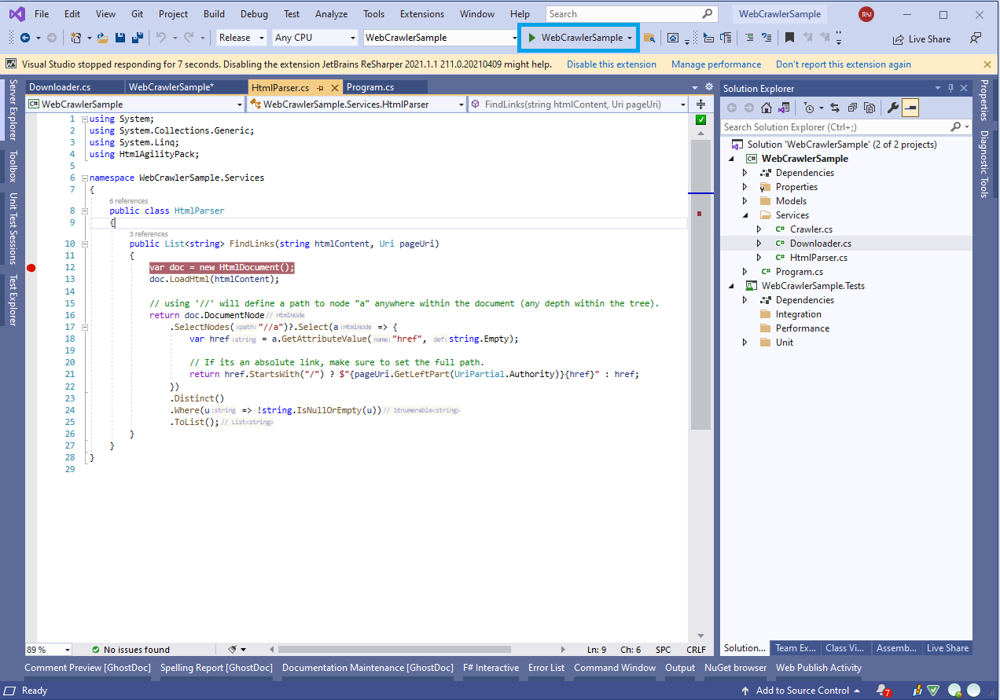
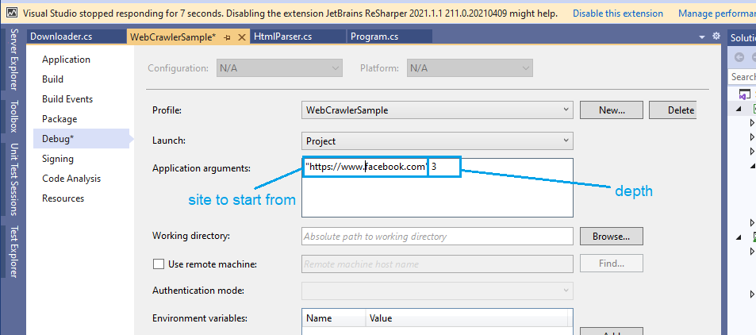
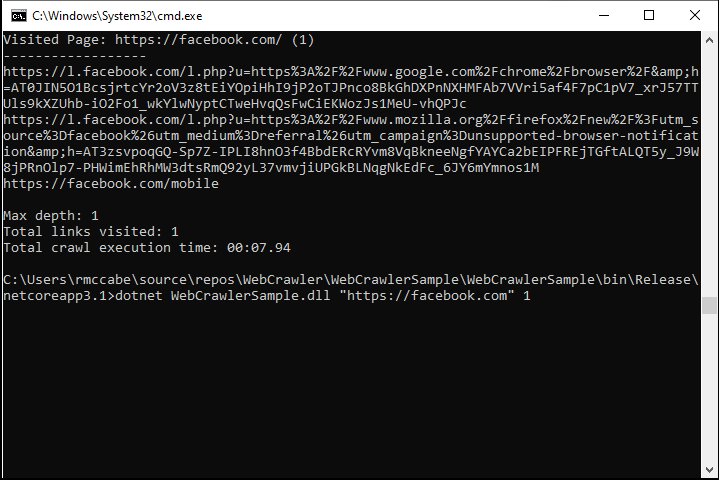

# Problem Brief

We'd like you to write a simple web crawler in a programming language you're familiar with. Given a starting URL, the crawler should visit each URL it finds on the same domain. It should print each URL visited, and a list of links found on that page. The crawler should be limited to one subdomain - so when you start with \*[https://monzo.com/\*](https://monzo.com/*), it would crawl all pages on the monzo.com website, but not follow external links, for example to [_facebook.com_](http://facebook.com/) or [_community.monzo.com_](http://community.monzo.com/).

_We would like to see your own implementation of a web crawler. Please do not use frameworks like scrapy or go-colly which handle all the crawling behind the scenes or someone else's code. You are welcome to use libraries to handle things like HTML parsing._

Ideally, write it as you would a production piece of code. This exercise is not meant to show us whether you can write code – we are more interested in how you design software. This means that we care less about a fancy UI or sitemap format, and more about how your program is structured: the trade-offs you've made, what behavior the program exhibits, and your use of concurrency, test coverage, and so on.

Requirements
------------

## Functional

The following product requirements have been identified:

*   Crawler product can visit each URL found on the same domain.
*   Every URL visited should be output, as well as the list of links found on that page.
*   Crawling should be limited to one subdomain (from initial root site URL), any other subdomain (even within same domain) should not be visited.
*   Crawling should not follow external links.
    

## Non-Functional

Follows production ready NFRs:

*   Pages where content-length exceeds a configurable size (default 300kb) should not be downloaded or parsed.
*   Crawl depth should be added to stop infinite crawl scenarios (such as could happen if google would be crawled).
*   Max request timeouts should be in place for around 10 seconds.
*   Progress of crawl should be observable in real-time, as well as summarised at the end.
*   Solution should be highly testable in an automated manner.
*   Request failures should be resilient and utilise retry mechanisms, where applicable.
*   Request retries should consider jitter, as to not swamp target servers under periods of high resource contention.
*   Requests that fall into the [4\*\* category](https://www.iana.org/assignments/http-status-codes/http-status-codes.xhtml) should not be retried, with the exception of a 429 - this may be acceptable to retry with an exponential back-off algorithm.
*   The [rules](https://developers.google.com/search/docs/advanced/robots/robots_meta_tag) within [Robots.txt](https://developers.google.com/search/docs/advanced/robots/intro) and metadata headers (such as `<meta name="robots" content="noindex" />`) should be honored.
*   Only attempt to process html content that follows the `text/html` media type.
*   Unit and Integration tests should be automated and can be run as part of CI/CD build.
    

Additional Considerations
-------------------------

*   Requests that are to aggressive may be perceived DDOS attack by target server/infrastructure - technology such as WAF, API Gateway/Manager, AFD, Akamai etc may attempt to restrict access. Some of the more sophisticated tools will inject large amounts of content or algorithms into the response to deliberately slow your response times in defense.
*   A standard Http GET when gathering the content will NOT work for SPA applications that have their content injected into the DOM after render. The crawler now uses [Playwright](https://playwright.dev/dotnet/) to render pages in a headless Chromium browser so that dynamically injected content is captured correctly.
    


# Implementation

I've written the code in C# using .net5.  To open the solution in the Visual Studio IDE, you'll need the [.net5 SDK](https://dotnet.microsoft.com/download/visual-studio-sdks).  Alternatively, the [.net5 runtime](https://dotnet.microsoft.com/download/dotnet/5.0) to execute the code.  Steps are outlined below.

## Program

The main entry point for the application - creates instances of the services for injection into the crawler (Crawler uses Dependency Inversion). Main role of this Program class is to run and then wait for the crawl to finish - it displays all the information gathered during a crawl.

### Trade-Offs

Console logging, no application life-cycle - all these trade-offs where made in the aid of time saving.

### Improvements

*   Output to another more readable format, such as sitemap > only outputs to console.
*   Generic error handling - possibly Try/Catch.
*   Implement `GenericHost` or `WebHost` to [handle application life cycle](https://docs.microsoft.com/en-us/aspnet/core/fundamentals/host/generic-host?view=aspnetcore-5.0), service/dependency management, logging, configuration etc. Similar to [SpringBoot](https://spring.io/guides/gs/spring-boot/) in java.
*   Using `ILogger` (and logging sources) instead of `Console` writes.
    

## Crawler

Starting from a root url, the crawler will follow links to a maximum allowed depth, visiting all with the same host address. Crawl result is returned at the end with all summary information but `PageCrawled` event can be acted upon.

Easily testing due to the Dependency Inversion approach to initialisation. Typically, I’d wire this up using `WebHost` or `GenericHost`

Heavily uses `async`/`await`, which are similar to [GoLang’s Goroutines](https://tour.golang.org/concurrency/1) from what I understand.

```
public async Task DoWork()
{
    var downloader = new Downloader();
    var parser = new HtmlParser();
    var crawler = new WebCrawler(downloader, parser);
    
    // Handle every time an event is fired.
    crawler.PageCrawled += (obj, page) => Console.WriteLine(FormatOutput(page)); 
    
    // Run crawl!
    var result = await crawler.RunAsync("https://www.crawler-test.com/", 3, CancellationToken.None);
    
    ...
}
```

### Trade-offs

Consider using await Task, rather than Task Parallelism to reduce memory consumption (large overhead in creating each of the threads).

### Improvements

*   Events fire in order.
*   Add cancellation token to stop crawling when requested.
*   Speed up with more concurrency (how?).
*   Gather number of hits and link used when hitting pages that have already been crawled.
*   Honor Robots.txt and metadata headers.
*   Introduce Rx (Reactive Extensions) to implement the Producer/Consumer pattern to make the code more cohesive.
    

## Downloader

This is used as a mechanism to download content without having to reinitialise the `HttpClient` every time. It will handle faults and retry policies.

Allows easy mocking of Http calls for automated testing, using an optional `HttpMessageHandler` in the constructor.

```
private async Task DoWork(Uri page)
{
    // grab content!
    return await _downloader.GetContent(currentPage);
}
```

### Trade-offs

Using the HttpClient into the code directly was much quicker to implement but, not using `IHttpClientFactory` means we should specify `disposehandler:false` when creating the client to avoid problems such as socket exhaustion issues.

### Improvements

*   Inject `IHttpClientFactory` and improve testability, as well as ensure the socket exhaustion does not happen.
*   Return status and content-length, as well as string content from the `GetContent` method - giving the caller more detail about the pages being visited.
*   More granular retries on specific errors or statuses (follow NFRs). Implement [jitter algorithm](https://github.com/App-vNext/Polly/wiki/Retry-with-jitter) using polly in the case of:
    *   server throttling/rate-limiting.
    *   WAF and bot mitigation protection.
*   Set a limit on the max download size.
*   Only download schema’s of http/https - ignore: mailto:, tel:, ftp:/sftp:, file:, and app custom (such as whatsapp: etc)
*   Only download content that is type text/plain.
*   Measure runtime of each request and pass back in poco class (along with status/content).
*   Specify MaxRequestContentBufferSize and the MaxAutomaticRedirections properties.
    

## HtmlParser

This will be used to take string (html) content and parse it in various ways - in demo version, parsing is only for links (`<a href=”…`) but the parser is open to extension in the future for other types of html parsing.

```
private void DoWork() 
{
    var sampleHtml = "<a href='/example1'>example1</a><a href='/example2'>example2</a>";
    var links = parser.FindLinks(sampleHtml, uri);
    ...
}
```

### Trade-Offs

Could possibly do the same work with a regEx and not have to use a 3rd party library but it was easier here to just consume the `HtmlAgilityPack` to do this work.

### Improvements

*   Check for nulls and throw argument exception to caller.
*   Only look specifically at links with schema of Http or Https and ignore the rest.
    

## Project Layout

The application structure is as follows:

```
- WebCrawlerSample - main application
      / Models
           - CrawlerPage.cs
           - CrawlerResult.cs     
      / Services          
           - WebCrawler.cs
           - Downloader.cs          
           - HtmlParser.cs      
      - Program.cs
- WebCrawlerSample.Tests - test project     
     / Performance     
     / Integration
          - CrawlerIntegrationTest.cs      
     / Unit          
          - CrawlerUnitTest.cs          
          - DownloaderUnitTest.cs          
          - ParserUnitTest.cs                          
```

# How to run

### Option 1 - Visual Studio

*   Click Run if the project is open within Visual Studio (see screenshot below):



*   You can set args by passing them in the through the project in the build window:



### Option 2 - Command Line

*   I’ve left a bin folder of the compiled code in the zip. Navigate to that folder in the command line. You can see the sample below, something similar to `<unzip_location>/bin/debug/net5.0`.    
*   From there you can simple run the command `dotnet WebCrawlerSample.dll` or double click the .exe file.
*   You can pass up to five parameters when running from the command line: the **base URL**, a **download flag** (`true`/`false`), the **maximum depth**, a comma separated list of links to **ignore**, and a **clean content** flag (`true`/`false`). If omitted they default to `"https://www.crawler-test.com/"`, `false`, `3`, an empty list and `false` respectively. Example usage:
    `dotnet WebCrawlerSample.dll "https://www.crawler-test.com" true 10 "link1,link2" true`.
    


# Testing

### Dev

During development the test site `https://www.crawler-test.com/` was ideal for me testing. It has all sorts of variants like malformed URLs, infinite loop redirects and pages with extremely large content. I regularly used that for testing, and in fact - the application uses this as the default address if no site URL arg is passed when running.

### Unit

Unit tests will test the Downloader, HtmlParser and Crawler services in isolation and verify they work as exp

### Integration

Integration tests will run the Crawler instance, without using mocks. Then ensure the results returned are as expected. This has been setup against (again) `https://www.crawler-test.com/` with depth 1 and it should find a result of 412 links on the site page, for example.

### Performance
Not implemented but normally I’d use [dotNetBenchmark](https://github.com/dotnet/BenchmarkDotNet) to measure performance.